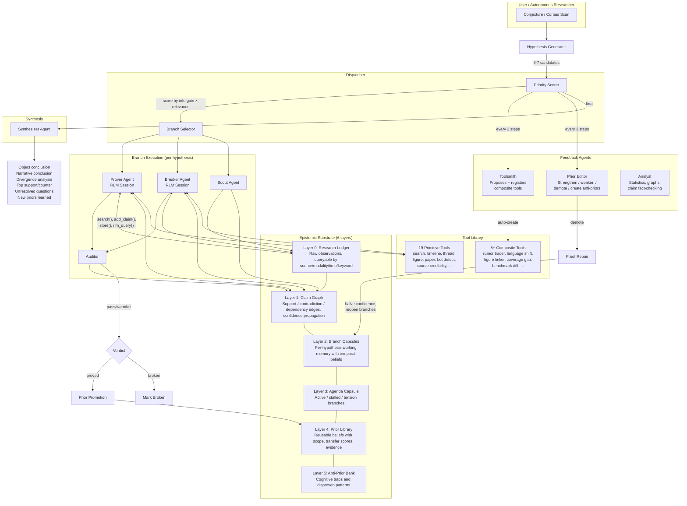

# LEMMA Lab

LEMMA Lab is a recursive, prior-building research system that treats investigation the way a mathematician treats a proof. User queries become conjectures, candidate explanations become hypotheses, tools become tactics, evidence becomes proof objects, and stable insights become reusable priors in a growing theorem library. The system accumulates structured knowledge in a shared epistemic substrate across runs.

Each agent operates as a recursive LM in the style of [alexzhang13/rlm](https://github.com/alexzhang13/rlm). Agents get a persistent REPL sandbox where they write Python code to query the epistemic substrate directly. The model decides what to load into its context window, stores intermediate results in named variables, and can spawn recursive sub-investigations via `rlm_query()` that get their own sandboxes at increasing depth. The model controls its own memory.

## Architecture



## How it works

The system maintains a six-layer recursive context: a raw observation ledger, a claim graph with typed support and contradiction edges, branch capsules that compress working memory without losing open questions, an agenda capsule for global scheduling, a prior library of reusable beliefs with scope and transfer scores, and an anti-prior bank of known cognitive traps to avoid.

When a conjecture enters the system, a hypothesis generator gets a REPL session where it writes code to scan the corpus, check existing priors and claims, and then proposes 3-7 candidate explanations with testable predictions and specific falsifiers. A dispatcher scores these by expected information gain and assigns them to parallel branches. For each branch, a prover agent gets its own REPL sandbox and writes search queries against the actual dataset, stores results in named variables, analyzes evidence with sub-LLM calls, and creates claims linked into the graph. A breaker agent simultaneously runs its own REPL session searching for counterevidence, checking source credibility, and identifying smuggled assumptions. Both agents can see and modify the shared claim graph, and can spawn recursive sub-investigations via `rlm_query()` for deep dives on sub-questions.

After each prove/break cycle, an auditor checks whether the branch actually earned its conclusion by examining citation quality, evidence strength, and ignored contradictions. Branches that pass with high confidence get their hypotheses proved and automatically promoted to priors. Branches that fail get broken. A capsule compressor then summarizes the branch state, preserving the full evidence trail including source observation content and open questions in an 800-character capsule that future agents can reference without reloading the entire context.

Every few steps, a toolsmith analyzes tool usage traces and proposes new composite tools that chain existing primitives into executable functions. A prior editor agent periodically reviews all active priors against the current claim graph, strengthening priors with new evidence, weakening ones that have counterexamples, creating new priors from stable patterns, demoting priors that are wrong, and creating anti-priors as warnings about reasoning traps. When a prior is demoted, proof repair kicks in: dependent claims are marked stale, affected branches have their confidence halved, and they get re-queued for investigation.

An analyst agent can run statistical analysis on the full dataset, generate graph specifications for visualization, and fact-check existing claims against actual data distributions.

## Recursive LM agents

The prover, breaker, and hypothesis generator are recursive LMs per [alexzhang13/rlm](https://github.com/alexzhang13/rlm). Each gets a `RLMSession` with a persistent Python namespace where variables accumulate across code execution blocks. The model writes `repl` code blocks that execute against the epistemic substrate APIs: `search()`, `claims()`, `priors()`, `add_claim()`, `link_claims()`, `store()`, `recall()`, `SHOW_VARS()`, `llm_query()`, and `rlm_query()`. The session supports `FINAL(answer)` and `FINAL_VAR(variable_name)` for signaling completion, safe builtins that block `eval`/`exec`/`compile` inside the sandbox, structured `REPLResult` tracking with stdout/stderr/locals/timing per code block, full trajectory logging, recursive depth control up to `max_depth`, and consecutive error limits. Sub-investigations spawned via `rlm_query()` get their own sandboxes at `depth+1` with access to the same shared substrate.

## Autonomous research

An autonomous researcher can run without human-injected conjectures. It scans the loaded corpus, identifies patterns and tensions, generates its own theses, investigates them through the full pipeline, and saves findings as priors. Each subsequent round of thesis generation sees the accumulated priors and previous run history, so it builds on or cross-tests earlier findings rather than repeating them.

## The swarm

LEMMA Lab includes a fully agentic X/Twitter simulation that generates the research corpus. Each agent is born from random seed words (fetched from a dictionary API), dreams up a life history, builds historical posts, and then participates in a live simulation. Agents have personalized algorithmic feeds weighted by language affinity, following relationships, shared interests, and geographic proximity. They can post, reply, quote, retweet, scroll profiles, follow each other, edit their profiles, and discover topics via web search. An observer agent periodically reads an agent's post history and writes an evolved persona description that becomes its new system prompt.

The simulation uses varying temperatures and randomly sampled models across personas for stochastic diversity. Agents don't have to respond to everything; engagement probability depends on language match, follow status, and energy levels with cooldown. Reply loops are capped, and agents are nudged toward original posts about their own lives rather than endless reaction chains. Notifications from @mentions propagate to the mentioned agent, who may or may not respond depending on language affinity and current energy.

## Production run results

The swarm simulation ran for 500 ticks over 11 hours, producing a fully synthetic X/Twitter corpus.

**Swarm output:**
543 agents from 82 countries posting in 110 languages generated 7,507 posts (3,827 historical, 3,680 live) including 6,024 original posts, 1,305 replies, and 178 quote-posts. The simulation produced 1,480 agent dreams, 145 web topic discoveries, 62 evolved personas, 151 follow relationships, and 8 profile edits. Total API cost was $1.91 across 5,545 calls.

**Autonomous research on the swarm corpus:**
The researcher autonomously generated and investigated 9 theses across 3 rounds without any human prompts. It accumulated 145 claims in the graph, promoted 40 reusable priors, and created 10 anti-priors. One prior was demoted mid-session after counterevidence emerged, triggering proof repair that reopened 2 branches for re-evaluation. Sample theses the system generated on its own included whether natural phenomena posts form interaction networks, whether ephemerality is a cross-linguistic artistic motif, whether sensory metaphors bridge personal and global experience, whether geographic clustering of motifs correlates with language, and whether @mention interactions serve reinforcement or debate.

**Single investigation on the handcrafted dataset (645 posts):**
Given the conjecture "Were Arbor-13B's multilingual gains real or a metric artifact amplified on X?", the system generated 5 hypotheses, ran 4 prove/break cycles with figure analysis by the scout agent, produced 76 claims (49 contradicted, 3 supported, 22 active), auto-created 6 composite tools via the toolsmith, and synthesized a report with 0.85 confidence correctly concluding that gains are real but confined to high-resource languages with narrative divergence from bot amplification and cropped screenshots. Total cost was $0.015.

## Running it

Set your xAI API key and install dependencies.

```
pip install -r requirements.txt
export XAI_API_KEY="your-key"
```

Generate the Polyglot Proof Crisis dataset from the handcrafted world specification (125 personas, 66 countries, 75 languages).

```
python main.py --mode generate
```

Or run the agentic swarm simulation to generate a fully synthetic corpus.

```
python main.py --mode swarm --budget 5.0 --seed-agents 15 --max-ticks 500
```

Run the autonomous researcher on any dataset. It will scan the corpus, generate its own theses, investigate them, and accumulate priors across rounds.

```
python main.py --mode research --dataset ./dataset_data/swarm_session.json --budget 2.0
```

Or start the interactive REPL for manual investigation.

```
python main.py --mode repl --dataset ./dataset_data/polyglot_crisis.json
```

The REPL supports 31 commands: ask, run, step, agenda, spawn, challenge, inspect, promote, demote, priors, claims, tools, tool, report, save, load_dataset, log, toolize, usage, stats, scout, analyze, edit_priors, snapshot, metrics, repairs, fetch, and quit.

Run a single investigation directly.

```
python main.py --mode ask --query "Was the breakthrough real?" --dataset ./dataset_data/polyglot_crisis.json --steps 5
```

Run the full benchmark comparing context ablations and model variants.

```
python main.py --mode benchmark --dataset ./dataset_data/polyglot_crisis.json
```

All state (ledger, claim graph, priors, run history) persists to JSON and carries across sessions. Future runs inherit accumulated knowledge.

## Models

All reasoning uses `grok-4-fast-reasoning` via the xAI API. Vision uses `grok-2-vision-1212`. The swarm randomly samples across `grok-4-fast-non-reasoning`, `grok-3`, and `grok-3-mini` for persona stochasticity. Cost tracking is built in at the per-model level.
